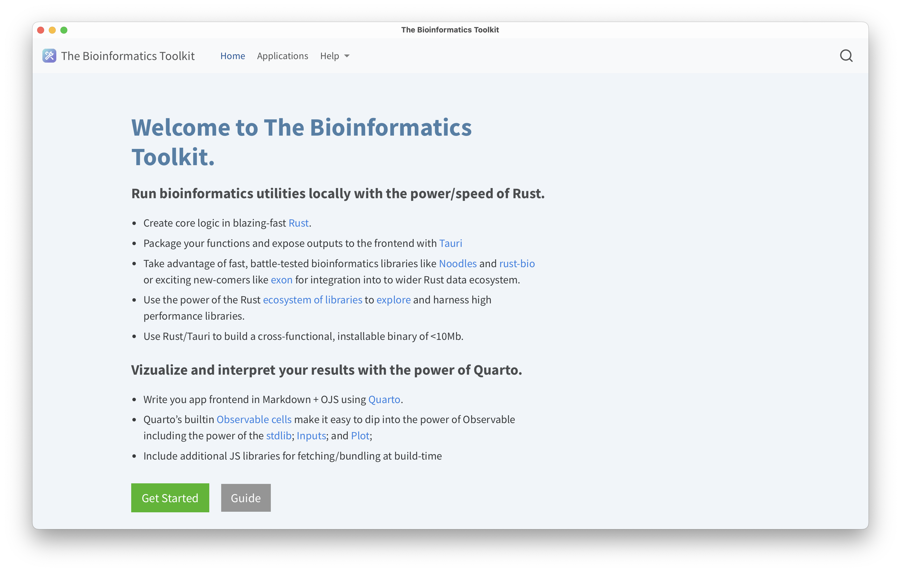
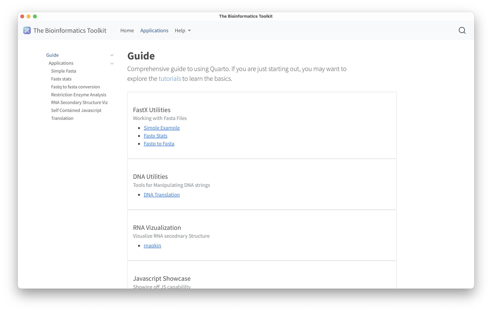
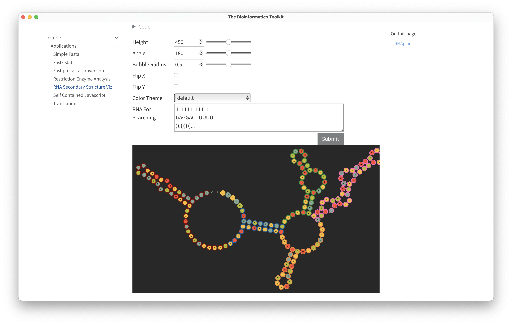
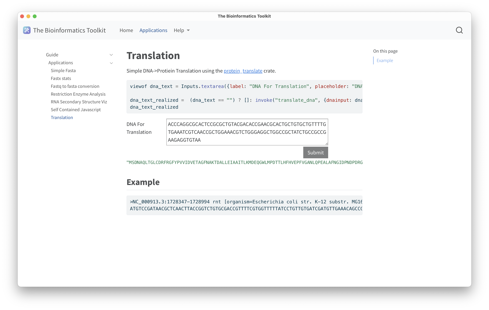

# The Bioinformatics Toolkit

RUST-backed utilities for bioinformatic data processing.


## Get started

The fastest way to get started it to download the applications found in the [Release]()https://github.com/zachcp/bioinformaticstoolkit/releases section. This project aims to demonstrate how the Rust toolchain enables efficient cross-platform support for high-performance applications. By using [Tauri](https://tauri.app/) you can write the entire frontend in  any tool that compiles to HMLT+Javascript, in this case I used [Quarto](https://quarto.org/) to take advantage of its simple composition (its mostly markdown +yaml) as well as it's built-in use of the [observable](https://github.com/observablehq/stdlib) runtime.


### Screenshots

Below are screenshots of a native application demonstrating the home page, the guide page, an example RNA secondary strucutre visualization using [rnapkin](https://github.com/ukmrs/rnapkin);statistics of a fasta file including a histrogram of sequence lengths using [noodles](https://docs.rs/noodles-fasta/latest/noodles_fasta/) for IO; and DNA translation using the [protein_translation](https://docs.rs/protein-translate/latest/protein_translate/) crate.









## Develop

```sh
# assuming quarto and cargo are installed and on your path.
git clone https://github.com/zachcp/bioinformaticstoolkit.git
cd bioinformaticstoolkit

# install the tauri cli
cargo install tauri-cli

# add cargo bind dir to the path
export PATH=$PATH:~/.cargo/bin/

# to develop 
cargo-tauri dev

# to package. this build is ~8MB. 
cargo-tauri build

# to test
cd src-tauri && cargo test
# or verbose
cd src-tauri && cargo test -- --nocapture

```


## Other Ideas/Tools for Rust Incorporation


FASTX:
  - [x] convert fasta to fastq
  - [x] basic stats of fasta/fastq 
  - [ ] histrogram of read lengths (possibly set max number)
  - [ ] merge PE reads // split interleaved
  - [ ] splitting into multiple files ( create directory ?)
  - [ ] filter-fastx length // quality
  - [ ] sample the fasta/x files
  - [ ] plot: length x quality metrics ( optional hexagon plots ) 
  - [ ] plot: coverage by location. 

GFA:
  - [ ] Utilites from [GFATK](https://docs.rs/gfatk/latest/gfatk/) including filtering
    - [ ] GFAStats


DNA Analysis:
  - Digestability of DNA sequences:
      - [ ] Search for RE locations
      - [ ] Other Patterns to Avoid
      - [ ] Data: Standard RE enzymes
      - [ ] Plot: Genome View of RE sites.
      - [ ] Global view of Palettes and coding types
  - [ ] Insilico PCR: https://github.com/dlesl/pcr
    - Clonifier: https://github.com/dlesl/clonifier
  - Phenogram
  - Pangenome TK: https://github.com/GeneDx/pgr-tk (cdep in the build)
  - RE digest and assembly calculations


VCF:
  - [ ] convert
  - [ ] concat
  - [ ] split

RNA Secondary Structure:
  - [x] RNApkin https://lib.rs/crates/rnapkin


rna-seq:
    - [ ] gencounts https://github.com/NKI-GCF/gensum
    - [ ] rust-lapper https://crates.io/crates/rust-lapper


Taxonomy:
  - [ ] load and display a tree file
  - [ ] load and display kraken
  - [ ] load and display bracken

Peptides and Proteomics: 
  - [unipept](https://crates.io/crates/umgap)


Javascript:
    - [SGTK](https://olga24912.github.io/SGTK/) 
    - [ribbon](https://github.com/MariaNattestad/ribbon?tab=readme-ov-file)
    - [jbrowse](https://jbrowse.org/jb2/docs/quickstart_web/
    - [ideogram](https://eweitz.github.io/ideogram/differential-expression)
    - [genomegraphviewer]()

Rust Software:
- [Pangenomer](https://github.com/marschall-lab/panacus)
- [rust-bio](https://github.com/rust-bio/rust-bio)
- [rust-bio-tools](https://github.com/rust-bio/rust-bio-tools)
- [Slyph](https://github.com/bluenote-1577/sylph/wiki/sylph-cookbook)
- [Alignoth](https://github.com/alignoth/alignoth)


Miscelleaneous:
  - Genome Card: e.g viz with global genome statistics.
    - Genome name, overview, produces compounds
  - Utilities for Codons
  - [VCF plotein](https://vcfplotein.liigh.unam.mx/)
  - [ASGArt](https://github.com/delehef/asgart) (cdep in the build)
  - [UDON](https://github.com/ocxtal/udon)
  - [GFAESTUS](https://github.com/chfi/gfaestus) (c++ dep )
  - [BioSeq](https://github.com/jeff-k/bio-seq)
  - [10x Genomics Rust](https://github.com/10XGenomics/rust-toolbox)
  - [fq parser](https://crates.io/crates/fastq)
  - [fastats](https://crates.io/crates/fakit)
  - [fqmerge](https://crates.io/crates/fqkit)
  - [ggcat](https://github.com/algbio/ggcat)
  - [light motif](https://crates.io/crates/lightmotif)
  - [liftover with crusmapr](liftover)
  - [exon](https://docs.rs/exon/latest/exon)
  - [phylogeny](https://docs.rs/phylogeny/latest/phylogeny/) # not much action
  - [chemical Reaction networks](https://lib.rs/crates/rebop)
  - [gb-io](https://lib.rs/crates/gb-io)
  - [charming - a nive gui library](https://github.com/yuankunzhang/charming)
  - [met map](https://lib.rs/crates/shu)
  - [barcode counter](https://lib.rs/crates/barcode-count)
  - [hpo](https://lib.rs/crates/hpo)
  - nanopore read assessment: https://lib.rs/crates/nanoq#readme-read-report
  - [niffler](https://github.com/luizirber/niffler/)
  - [OBO Validatio](https://lib.rs/crates/fastobo-validator)
  - [rustyms](https://lib.rs/crates/rustyms)
  - [preotienogenic](https://lib.rs/crates/proteinogenic)
  - [rdkit](https://lib.rs/crates/rdk)
  - [bigwig2bam](https://lib.rs/crates/bigwig2bam)
  - Plasmapr: https://github.com/BradyAJohnston/plasmapR
  - [flate2](https://docs.rs/flate2/latest/flate2/)use flate2::read::MultiGzDecoder;
  - [bio_streams](https://github.com/jeff-k/bio-streams) 
  - Streaming iterators for bioinformatics data 

# bioinformatics-toolkit

This is an [Observable Framework](https://observablehq.com/framework) project. To start the local preview server, run:

```
npm run dev
```

Then visit <http://localhost:3000> to preview your project.

For more, see <https://observablehq.com/framework/getting-started>.

## Project structure

A typical Framework project looks like this:

```ini
.
├─ docs
│  ├─ components
│  │  └─ timeline.js           # an importable module
│  ├─ data
│  │  ├─ launches.csv.js       # a data loader
│  │  └─ events.json           # a static data file
│  ├─ example-dashboard.md     # a page
│  ├─ example-report.md        # another page
│  └─ index.md                 # the home page
├─ .gitignore
├─ observablehq.config.ts      # the project config file
├─ package.json
└─ README.md
```

**`docs`** - This is the “source root” — where your source files live. Pages go here. Each page is a Markdown file. Observable Framework uses [file-based routing](https://observablehq.com/framework/routing), which means that the name of the file controls where the page is served. You can create as many pages as you like. Use folders to organize your pages.

**`docs/index.md`** - This is the home page for your site. You can have as many additional pages as you’d like, but you should always have a home page, too.

**`docs/data`** - You can put [data loaders](https://observablehq.com/framework/loaders) or static data files anywhere in your source root, but we recommend putting them here.

**`docs/components`** - You can put shared [JavaScript modules](https://observablehq.com/framework/javascript/imports) anywhere in your source root, but we recommend putting them here. This helps you pull code out of Markdown files and into JavaScript modules, making it easier to reuse code across pages, write tests and run linters, and even share code with vanilla web applications.

**`observablehq.config.ts`** - This is the [project configuration](https://observablehq.com/framework/config) file, such as the pages and sections in the sidebar navigation, and the project’s title.

## Command reference

| Command           | Description                                              |
| ----------------- | -------------------------------------------------------- |
| `npm install`            | Install or reinstall dependencies                        |
| `npm run dev`        | Start local preview server                               |
| `npm run build`      | Build your static site, generating `./dist`              |
| `npm run deploy`     | Deploy your project to Observable                        |
| `npm run clean`      | Clear the local data loader cache                        |
| `npm run observable` | Run commands like `observable help`                      |
