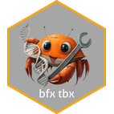

# The Bioinformatics Toolkit

RUST-backed utilities for bioinformatic data processing. Rust on the backend with JS on the front.




## Develop

```sh
git clone https://github.com/zachcp/bioinformaticstoolkit.git
cd bioinformaticstoolkit
npm run tauri dev
npm run tauri build
```

### Screenshots


